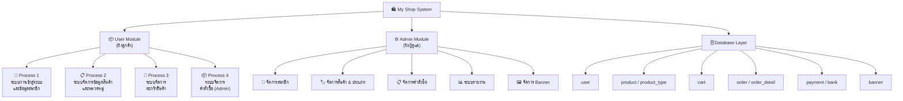
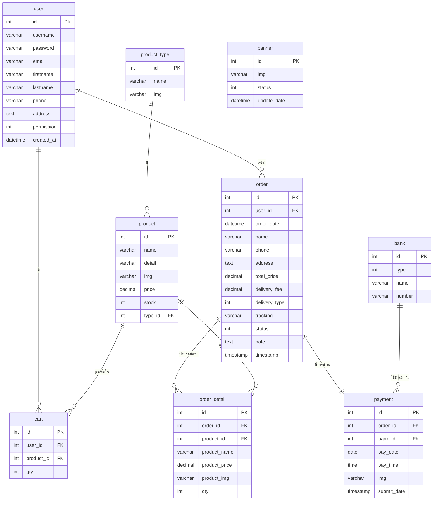

# การออกแบบสถาปัตยกรรมระบบ (Architecture Design)

## ระบบร้านค้าออนไลน์จำหน่ายแว่นกันแดด — My Shop

---

## 1. ภาพรวมระบบ (System Overview)

ระบบ **My Shop** เป็นเว็บแอปพลิเคชันสำหรับร้านค้าออนไลน์จำหน่ายแว่นกันแดด พัฒนาด้วย PHP และ MySQL บน XAMPP Stack โดยใช้รูปแบบสถาปัตยกรรม **Client-Server Architecture** ผ่านโปรโตคอล HTTP/HTTPS

ระบบแบ่งผู้ใช้งานออกเป็น 2 กลุ่มหลัก:

| กลุ่มผู้ใช้             | คำอธิบาย                      | สิทธิ์การเข้าถึง                                 |
| ----------------------- | ----------------------------- | ------------------------------------------------ |
| **User (ลูกค้า)**       | ผู้ใช้งานทั่วไปที่ซื้อสินค้า  | หน้าร้านค้า, ตะกร้า, ชำระเงิน, ประวัติคำสั่งซื้อ |
| **Admin (ผู้ดูแลระบบ)** | เจ้าหน้าที่จัดการระบบหลังบ้าน | จัดการสินค้า, คำสั่งซื้อ, สมาชิก, รายงาน         |

---

## 2. แผนภาพสถาปัตยกรรมระบบ (Architecture Diagram)


---

## 3. สถาปัตยกรรม Client-Server (Client-Server Architecture)

ระบบใช้รูปแบบ **2-Tier Client-Server Architecture** โดยแบ่งชั้นการทำงานออกเป็น:

```
┌─────────────────────────────────────────────────────────────────────┐
│                        CLIENT LAYER                                  │
│  ┌──────────────┐              ┌──────────────┐                      │
│  │  User        │              │  Admin        │                     │
│  │  (ลูกค้า)   │              │  (ผู้ดูแล)   │                      │
│  └──────┬───────┘              └──────┬────────┘                    │
│         │  Web Browser (Chrome/etc.)  │                              │
└─────────┼────────────────────────────┼──────────────────────────────┘
          │  HTTP Request (GET/POST)    │
          ▼                            ▼
┌─────────────────────────────────────────────────────────────────────┐
│                        SERVER LAYER (XAMPP)                          │
│  ┌───────────────────────────────────────────────────────────────┐  │
│  │                  Apache Web Server                             │  │
│  │              (รับ HTTP Request / ส่ง HTTP Response)           │  │
│  └────────────────────────┬──────────────────────────────────────┘  │
│                           │                                          │
│  ┌────────────────────────▼──────────────────────────────────────┐  │
│  │                  PHP Engine                                    │  │
│  │  ┌─────────────────────────────────────────────────────────┐  │  │
│  │  │              index.php (Front Controller / Router)      │  │  │
│  │  └──────────────┬────────────────────┬────────────────────-┘  │  │
│  │                 │                    │                          │  │
│  │    ┌────────────▼──────┐  ┌──────────▼──────────┐             │  │
│  │    │   User Pages      │  │   Admin Pages        │             │  │
│  │    │   /pages/*.php    │  │   /admin/pages/*.php │             │  │
│  │    └───────────────────┘  └──────────────────────┘             │  │
│  └────────────────────────┬──────────────────────────────────────┘  │
│                           │  SQL Query                               │
│  ┌────────────────────────▼──────────────────────────────────────┐  │
│  │               MySQL Database (myshop)                          │  │
│  └───────────────────────────────────────────────────────────────┘  │
└─────────────────────────────────────────────────────────────────────┘
```

### การสื่อสารระหว่าง Client และ Server

| ทิศทาง          | โปรโตคอล        | รูปแบบข้อมูล            |
| --------------- | --------------- | ----------------------- |
| Client → Server | HTTP GET / POST | Form Data, Query String |
| Server → Client | HTTP Response   | HTML, PHP-rendered Page |
| PHP → MySQL     | TCP (localhost) | SQL Query / Result Set  |

---

## 4. Technology Stack

| ส่วนประกอบ           | เทคโนโลยี               | รายละเอียด                   |
| -------------------- | ----------------------- | ---------------------------- |
| **Web Server**       | Apache 2.4              | จัดการ HTTP Request/Response |
| **Backend Language** | PHP 8.2                 | ประมวลผลฝั่ง Server          |
| **Database**         | MariaDB 10.4 (MySQL)    | จัดเก็บข้อมูลทั้งหมด         |
| **Frontend**         | HTML5, CSS3, JavaScript | UI ฝั่ง Client               |
| **Runtime Platform** | XAMPP (localhost)       | สภาพแวดล้อมการพัฒนา          |
| **Package Manager**  | npm (browser-sync)      | เครื่องมือพัฒนา              |

---

## 5. โครงสร้างไดเรกทอรี (Directory Structure)

```
my_shop/                          ← Root Directory
│
├── index.php                     ← Front Controller (Entry Point)
│
├── core/                         ← Core System Files
│   ├── config/
│   │   ├── config_database.php   ← Database Connection Settings
│   │   ├── config_routes.php     ← URL Routing Definitions
│   │   └── config_website.php    ← Website Settings
│   ├── helpers/                  ← Helper Functions
│   └── services/                 ← Service Classes
│
├── pages/                        ← User-Facing Pages
│   ├── home.php                  ← หน้าแรก
│   ├── login.php                 ← เข้าสู่ระบบ
│   ├── register.php              ← สมัครสมาชิก
│   ├── products.php              ← รายการสินค้า
│   ├── product.php               ← รายละเอียดสินค้า
│   ├── cart.php                  ← ตะกร้าสินค้า
│   ├── cart-increase.php         ← เพิ่มจำนวน
│   ├── cart-decrease.php         ← ลดจำนวน
│   ├── cart-remove.php           ← ลบสินค้า
│   ├── confirm.php               ← ยืนยันคำสั่งซื้อ
│   ├── payment.php               ← ชำระเงิน
│   ├── order-history.php         ← ประวัติคำสั่งซื้อ
│   ├── order-detail.php          ← รายละเอียดคำสั่งซื้อ
│   ├── profile.php               ← โปรไฟล์
│   ├── profile-edit.php          ← แก้ไขโปรไฟล์
│   ├── change-password.php       ← เปลี่ยนรหัสผ่าน
│   ├── forgot-password.php       ← ลืมรหัสผ่าน
│   ├── faq.php                   ← วิธีการสั่งซื้อ
│   ├── contact.php               ← ติดต่อเรา
│   ├── tos-and-privacy.php       ← ข้อกำหนดและนโยบาย
│   └── logout.php                ← ออกจากระบบ
│
├── admin/                        ← Admin Back-Office
│   ├── index.php                 ← Admin Front Controller
│   ├── layouts/                  ← Admin UI Layout
│   └── pages/
│       ├── home.php              ← Dashboard
│       ├── users.php             ← จัดการสมาชิก
│       ├── products.php          ← จัดการสินค้า
│       ├── product_types.php     ← จัดการประเภทสินค้า
│       ├── product_stocks.php    ← จัดการสต็อกสินค้า
│       ├── orders.php            ← รายการคำสั่งซื้อ
│       ├── order.php             ← รายละเอียดคำสั่งซื้อ
│       ├── banners.php           ← จัดการป้ายโฆษณา
│       ├── reports.php           ← เมนูรายงาน
│       ├── report-users.php      ← รายงานสมาชิก
│       ├── report-products.php   ← รายงานสินค้า
│       ├── report-sales.php      ← รายงานการขาย
│       ├── report-payments.php   ← รายงานการชำระเงิน
│       ├── report-revenue.php    ← รายงานยอดรายได้
│       ├── report-best-sellers.php ← รายงานสินค้าขายดี
│       └── report-product-stocks.php ← รายงานสต็อก
│
├── layouts/                      ← User UI Layout (Header, Footer)
├── assets/                       ← Static Files (CSS, JS, Images)
├── upload/                       ← Uploaded Files (Product Images, etc.)
└── database/                     ← SQL Database Files
    ├── database_structure.sql
    └── myshop_v1.2.0.sql
```

---

## 6. กลไกการ Routing (Routing Mechanism)

ระบบใช้ **Front Controller Pattern** โดย `index.php` ทำหน้าที่เป็นจุดเข้าหลักของทุก Request:

```
HTTP Request: /?page=products
        │
        ▼
   index.php
        │
        ├─ อ่าน ?page= parameter
        ├─ ตรวจสอบใน ROUTES[]
        ├─ ตรวจสอบสิทธิ์ (Session/Permission)
        │
        ├─ [ถ้า page ถูกต้อง] → include pages/{page}.php
        └─ [ถ้า page ไม่มี]   → include pages/404.php
```

### Route Map — User

| URL Parameter         | ไฟล์                    | คำอธิบาย          |
| --------------------- | ----------------------- | ----------------- |
| `?page=home`          | pages/home.php          | หน้าแรก           |
| `?page=login`         | pages/login.php         | เข้าสู่ระบบ       |
| `?page=register`      | pages/register.php      | สมัครสมาชิก       |
| `?page=products`      | pages/products.php      | รายการสินค้า      |
| `?page=cart`          | pages/cart.php          | ตะกร้าสินค้า      |
| `?page=confirm`       | pages/confirm.php       | ยืนยันคำสั่งซื้อ  |
| `?page=payment`       | pages/payment.php       | ชำระเงิน          |
| `?page=order-history` | pages/order-history.php | ประวัติคำสั่งซื้อ |

### Route Map — Admin

| URL Parameter    | ไฟล์                     | คำอธิบาย         |
| ---------------- | ------------------------ | ---------------- |
| `?page=home`     | admin/pages/home.php     | Dashboard        |
| `?page=products` | admin/pages/products.php | จัดการสินค้า     |
| `?page=orders`   | admin/pages/orders.php   | รายการคำสั่งซื้อ |
| `?page=users`    | admin/pages/users.php    | จัดการสมาชิก     |
| `?page=reports`  | admin/pages/reports.php  | เมนูรายงาน       |

---

## 7. โมดูลของระบบ (System Modules)



---

## 8. โครงสร้างฐานข้อมูล (Database Schema)

ฐานข้อมูล: **`myshop`** | Engine: **InnoDB** | Charset: **utf8mb4**



### ตารางและความสัมพันธ์

| ตาราง          | คำอธิบาย                                           | ความสัมพันธ์หลัก    |
| -------------- | -------------------------------------------------- | ------------------- |
| `user`         | ข้อมูลสมาชิก / permission=0 คือ User, =1 คือ Admin | FK ใน cart, order   |
| `product`      | ข้อมูลสินค้า (ชื่อ, ราคา, สต็อก, รูป)              | FK → product_type   |
| `product_type` | หมวดหมู่สินค้า                                     | Parent ของ product  |
| `cart`         | สินค้าในตะกร้า (ชั่วคราว)                          | FK → user, product  |
| `order`        | คำสั่งซื้อ (สถานะ 0-4)                             | FK → user           |
| `order_detail` | รายการสินค้าในคำสั่งซื้อ                           | FK → order, product |
| `payment`      | หลักฐานการชำระเงิน                                 | FK → order, bank    |
| `bank`         | ข้อมูลบัญชีธนาคาร                                  | Parent ของ payment  |
| `banner`       | ป้ายโฆษณา (Slider)                                 | ตารางอิสระ          |

### สถานะคำสั่งซื้อ (Order Status)

| Status | ความหมาย                          |
| ------ | --------------------------------- |
| `0`    | รอชำระเงิน (Pending Payment)      |
| `1`    | รอตรวจสอบ (Awaiting Verification) |
| `2`    | กำลังจัดส่ง (Shipping)            |
| `3`    | สำเร็จ (Completed)                |
| `4`    | ยกเลิก (Cancelled)                |

---

## 9. กระบวนการหลักของระบบ (Main Process Overview)

| Process | ชื่อกระบวนการ                     | Pages ที่เกี่ยวข้อง                                                      | ตาราง DB                                   |
| ------- | --------------------------------- | ------------------------------------------------------------------------ | ------------------------------------------ |
| **P1**  | ระบบการเข้าสู่ระบบและข้อมูลสมาชิก | login, register, profile, profile-edit, change-password, forgot-password | `user`                                     |
| **P2**  | ระบบจัดการข้อมูลสินค้าและหมวดหมู่ | products, product, admin/products, admin/product_types                   | `product`, `product_type`                  |
| **P3**  | ระบบจัดการตะกร้าสินค้า            | cart, cart-increase, cart-decrease, cart-remove, confirm, payment        | `cart`, `order`, `order_detail`, `payment` |
| **P4**  | ระบบจัดการคำสั่งซื้อ (Admin)      | admin/orders, admin/order                                                | `order`, `order_detail`, `payment`         |

---

## 10. ความปลอดภัยของระบบ (Security Model)

| มาตรการ              | การนำไปใช้                                          |
| -------------------- | --------------------------------------------------- |
| **Authentication**   | PHP Session (`$_SESSION`) ตรวจสอบก่อนเข้าทุกหน้า    |
| **Authorization**    | `permission` field ใน `user` table แยก User / Admin |
| **Password Hashing** | เข้ารหัสรหัสผ่านก่อนบันทึก                          |
| **Input Validation** | ตรวจสอบข้อมูล POST ก่อนประมวลผล                     |
| **Admin Protection** | Admin pages ตรวจสอบ permission=1 ก่อนแสดงผล         |

---

## 11. ข้อมูลการพัฒนาระบบ (Development Info)

| รายการ          | รายละเอียด                                    |
| --------------- | --------------------------------------------- |
| **ชื่อระบบ**    | My Shop — ระบบร้านค้าออนไลน์จำหน่ายแว่นกันแดด |
| **ฐานข้อมูล**   | myshop (MariaDB 10.4)                         |
| **Host**        | localhost (XAMPP)                             |
| **URL หลัก**    | http://localhost/my_shop/                     |
| **URL Admin**   | http://localhost/my_shop/admin/               |
| **PHP Version** | 8.2.12                                        |
| **Version**     | v1.2.0                                        |
