# DFD Level 2 — Process 1: ระบบการเข้าสู่ระบบและข้อมูลสมาชิก

> อ้างอิงจากโค้ดจริงในระบบ: `login.php`, `register.php`, `logout.php`, `profile.php`, `profile-edit.php`, `change-password.php`, `forgot-password.php`

---

## แผนภาพ DFD Level 2

```mermaid
flowchart TD
    %% ── External Entities ──────────────────────────────────────────
    U(["👤 สมาชิก / ผู้ใช้ทั่วไป"])
    A(["🛡️ แอดมิน"])

    %% ── Data Stores ─────────────────────────────────────────────────
    DS1[("D1 : ตาราง user")]
    DS2[("D2 : Session")]

    %% ── Sub-Processes ────────────────────────────────────────────────
    P11["1.1\nตรวจสอบข้อมูล\nเข้าสู่ระบบ"]
    P12["1.2\nสมัครสมาชิก"]
    P13["1.3\nแสดงข้อมูล\nสมาชิก"]
    P14["1.4\nแก้ไขข้อมูล\nสมาชิก"]
    P15["1.5\nเปลี่ยนรหัสผ่าน"]
    P16["1.6\nรีเซ็ตรหัสผ่าน\n(ลืมรหัสผ่าน)"]

    %% ── Flows: Login ─────────────────────────────────────────────────
    U -->|"username, password"| P11
    P11 -->|"ค้นหาผู้ใช้ด้วย username"| DS1
    DS1 -->|"ข้อมูล user + hashed password"| P11
    P11 -->|"uid, permission → Session"| DS2
    DS2 -->|"ผลลัพธ์การเข้าสู่ระบบ"| U
    P11 -->|"redirect → admin"| A
    P11 -->|"แจ้งเตือน: บัญชีถูกระงับ / รหัสผ่านผิด / ไม่พบผู้ใช้"| U

    %% ── Flows: Register ──────────────────────────────────────────────
    U -->|"firstname, lastname, phone, email,\naddress, username, password"| P12
    P12 -->|"ตรวจสอบ email/phone ซ้ำ"| DS1
    DS1 -->|"ผลการตรวจสอบ"| P12
    P12 -->|"INSERT user (permission=1)"| DS1
    P12 -->|"redirect → login / แจ้งเตือน"| U

    %% ── Flows: View Profile ──────────────────────────────────────────
    U -->|"ขอดูข้อมูลส่วนตัว"| P13
    DS2 -->|"uid (session)"| P13
    P13 -->|"SELECT user + orders"| DS1
    DS1 -->|"ชื่อ, อีเมล, โทรศัพท์,\nที่อยู่, สถิติคำสั่งซื้อ"| P13
    P13 -->|"แสดงข้อมูลส่วนตัว"| U

    %% ── Flows: Edit Profile ──────────────────────────────────────────
    U -->|"firstname, lastname, email,\nphone, address (แก้ไข)"| P14
    DS2 -->|"uid (session)"| P14
    P14 -->|"ตรวจสอบ email/phone ซ้ำ"| DS1
    DS1 -->|"ผลการตรวจสอบ"| P14
    P14 -->|"UPDATE user"| DS1
    P14 -->|"update_session_user()"| DS2
    P14 -->|"บันทึกสำเร็จ / แจ้งเตือน"| U

    %% ── Flows: Change Password ───────────────────────────────────────
    U -->|"รหัสผ่านเดิม,\nรหัสผ่านใหม่ (×2)"| P15
    DS2 -->|"uid (session)"| P15
    P15 -->|"SELECT user (get_session_user)"| DS1
    DS1 -->|"hashed password"| P15
    P15 -->|"UPDATE password (bcrypt)"| DS1
    P15 -->|"เปลี่ยนสำเร็จ / แจ้งเตือน"| U

    %% ── Flows: Forgot Password ───────────────────────────────────────
    U -->|"Step 1: username + email"| P16
    P16 -->|"ค้นหา username + email"| DS1
    DS1 -->|"ข้อมูล user"| P16
    P16 -->|"บันทึก reset_uid, reset_otp → Session"| DS2
    U -->|"Step 2: OTP 6 หลัก"| P16
    DS2 -->|"reset_otp (เปรียบเทียบ)"| P16
    U -->|"Step 3: new_password, confirm_password"| P16
    P16 -->|"UPDATE password (hash)"| DS1
    P16 -->|"ล้าง session reset + redirect login"| DS2
    P16 -->|"แจ้งเตือนแต่ละขั้นตอน"| U

    %% ── Styling ──────────────────────────────────────────────────────
    style U        fill:#4A90D9,color:#fff,stroke:#2c6fad
    style A        fill:#E67E22,color:#fff,stroke:#b35c0c
    style DS1      fill:#27AE60,color:#fff,stroke:#1a7a43
    style DS2      fill:#8E44AD,color:#fff,stroke:#6c2d8a
    style P11      fill:#2C3E50,color:#fff,stroke:#1a252f
    style P12      fill:#2C3E50,color:#fff,stroke:#1a252f
    style P13      fill:#2C3E50,color:#fff,stroke:#1a252f
    style P14      fill:#2C3E50,color:#fff,stroke:#1a252f
    style P15      fill:#2C3E50,color:#fff,stroke:#1a252f
    style P16      fill:#2C3E50,color:#fff,stroke:#1a252f
```



---

## คำอธิบาย Sub-Processes

| หมายเลข | ชื่อกระบวนการ | ไฟล์ที่เกี่ยวข้อง | คำอธิบาย |
|---------|--------------|-----------------|---------|
| **1.1** | ตรวจสอบข้อมูลเข้าสู่ระบบ | `login.php` | รับ username + password → ค้นหาใน DB → ตรวจ `password_verify()` → สร้าง Session หรือแจ้งข้อผิดพลาด → แยก redirect ตาม permission (1=สมาชิก, 2=แอดมิน, 0=ถูกระงับ) |
| **1.2** | สมัครสมาชิก | `register.php` | รับข้อมูลทั้งหมด → ตรวจ email/phone ซ้ำ → `password_hash()` → INSERT user (permission=1) → redirect login |
| **1.3** | แสดงข้อมูลสมาชิก | `profile.php` | อ่าน uid จาก Session → SELECT ข้อมูล user + สถิติคำสั่งซื้อ (ทั้งหมด/จัดส่ง/รอดำเนินการ/รอชำระ) → แสดงผล |
| **1.4** | แก้ไขข้อมูลสมาชิก | `profile-edit.php` | รับข้อมูลที่แก้ไข → ตรวจ email/phone ซ้ำ (เว้น id ตัวเอง) → UPDATE user → อัปเดต Session |
| **1.5** | เปลี่ยนรหัสผ่าน | `change-password.php` | ตรวจรหัสผ่านเดิมด้วย `password_verify()` → ตรวจรหัสผ่านใหม่ตรงกัน → UPDATE password (bcrypt) |
| **1.6** | รีเซ็ตรหัสผ่าน | `forgot-password.php` | **3 ขั้นตอน** — ยืนยันตัวตน (username+email) → ส่ง OTP 6 หลัก → ยืนยัน OTP → ตั้งรหัสผ่านใหม่ → ล้าง Session |

---

## Data Stores

| ชื่อ | ตาราง/ที่เก็บ | ข้อมูลหลัก |
|------|------------|-----------|
| **D1 : ตาราง user** | `user` (MySQL) | `id`, `firstname`, `lastname`, `email`, `phone`, `address`, `username`, `password` (bcrypt), `permission` |
| **D2 : Session** | PHP Session | `uid`, `permission`, `name`, `reset_uid`, `reset_otp`, `reset_email`, `reset_username` |

---

## External Entities

| Entity | บทบาท |
|--------|-------|
| **👤 สมาชิก / ผู้ใช้ทั่วไป** | ผู้ส่งข้อมูลเข้าสู่ระบบทุก process (login, register, profile, reset password) |
| **🛡️ แอดมิน** | รับ redirect เมื่อ permission = 2 หลังเข้าสู่ระบบสำเร็จ |

---

## Data Flows สรุป

```
สมาชิก ──[username, password]──► 1.1 ──[SELECT user]──► D1 (user)
                                  1.1 ──[uid, permission]──► D2 (Session)

สมาชิก ──[ข้อมูลสมัครสมาชิก]──► 1.2 ──[INSERT user]──► D1 (user)

สมาชิก ──[ขอดูโปรไฟล์]──► 1.3 ◄──[user + orders]──► D1 (user)
                            1.3 ◄──[uid]──► D2 (Session)

สมาชิก ──[ข้อมูลแก้ไข]──► 1.4 ──[UPDATE user]──► D1 (user)
                             1.4 ──[update session]──► D2 (Session)

สมาชิก ──[รหัสผ่านเดิม+ใหม่]──► 1.5 ──[UPDATE password]──► D1 (user)

สมาชิก ──[username+email / OTP / password ใหม่]──► 1.6 ──[UPDATE password]──► D1 (user)
                                                    1.6 ──[reset session]──► D2 (Session)
```
