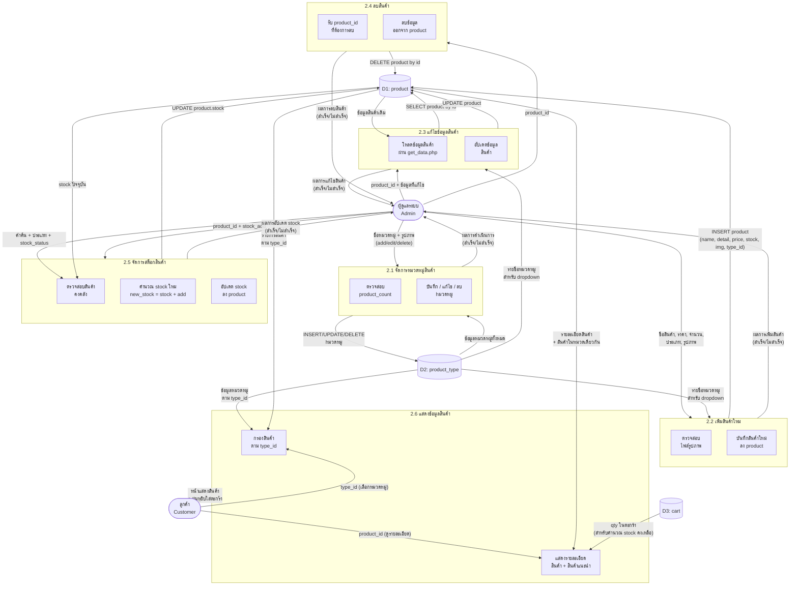

# DFD Level 2 — Process 2: ระบบจัดการข้อมูลสินค้าและหมวดหมู่

> อ้างอิงจากโค้ดจริงในระบบ: `admin/pages/products.php`, `admin/pages/product_types.php`, `admin/pages/product_stocks.php`, `pages/products.php`, `pages/product.php`

---

## ภาพรวม Sub-Processes

| # | กระบวนการ | ไฟล์อ้างอิง |
|---|-----------|-------------|
| **2.1** | จัดการหมวดหมู่สินค้า (Category Management) | `admin/pages/product_types.php` |
| **2.2** | เพิ่มสินค้าใหม่ (Add Product) | `admin/pages/products.php` → action: `add` |
| **2.3** | แก้ไขข้อมูลสินค้า (Edit Product) | `admin/pages/products.php` → action: `edit` |
| **2.4** | ลบสินค้า (Delete Product) | `admin/pages/products.php` → action: `delete` |
| **2.5** | จัดการสต็อกสินค้า (Stock Management) | `admin/pages/product_stocks.php` → action: `add_stock` |
| **2.6** | แสดงข้อมูลสินค้าให้ลูกค้า (Display Products) | `pages/products.php`, `pages/product.php` |

---

## External Entities

| สัญลักษณ์ | ชื่อ | บทบาท |
|-----------|------|--------|
| **E1** | ผู้ดูแลระบบ (Admin) | จัดการข้อมูลสินค้าและหมวดหมู่ทั้งหมด |
| **E2** | ลูกค้า (Customer) | ดูรายการสินค้าและรายละเอียดสินค้า |

---

## Data Stores

| สัญลักษณ์ | ชื่อ DB Table | ฟิลด์หลัก |
|-----------|--------------|-----------|
| **D1** | `product` | `id`, `name`, `detail`, `price`, `stock`, `img`, `type_id` |
| **D2** | `product_type` | `id`, `name`, `img` |
| **D3** | `cart` | `id`, `user_id`, `product_id`, `qty` |

---

## แผนภาพ DFD Level 2



---

## รายละเอียด Sub-Processes

### 2.1 จัดการหมวดหมู่สินค้า
> ไฟล์: `admin/pages/product_types.php`

| Flow | รายละเอียด |
|------|-----------|
| **Input** | ชื่อหมวดหมู่ (`type_name`), รูปภาพ (`type_img`), `action` = add/edit/delete |
| **Process** | ตรวจสอบ `product_count` ก่อนลบ — ถ้ามีสินค้าในหมวดนั้นจะ **ไม่อนุญาตให้ลบ** |
| **Output** | INSERT / UPDATE / DELETE ลงตาราง `product_type` |
| **Validation** | `is_image()` ตรวจสอบไฟล์รูปภาพ, ป้องกันลบเมื่อ `product_count > 0` |

---

### 2.2 เพิ่มสินค้าใหม่
> ไฟล์: `admin/pages/products.php` → `case 'add'`

| Flow | รายละเอียด |
|------|-----------|
| **Input** | `product_name`, `product_description`, `product_price`, `product_quantity`, `product_type`, `product_image` (optional) |
| **Process** | ตรวจสอบรูปภาพ → อัปโหลดไปที่ `upload/product/` → INSERT ลง `product` |
| **Default Image** | หากไม่แนบรูป จะใช้ `'default.jpg'` |
| **Output** | บันทึกสินค้าใหม่ลงตาราง `product` |

---

### 2.3 แก้ไขข้อมูลสินค้า
> ไฟล์: `admin/pages/products.php` → `case 'edit'`

| Flow | รายละเอียด |
|------|-----------|
| **Input** | `id`, `product_name`, `product_description`, `product_price`, `product_quantity`, `product_type`, `product_image` (optional) |
| **Pre-load** | ดึงข้อมูลสินค้าจาก `core/helpers/get_data.php?type=product&id={id}` ผ่าน Fetch API |
| **Process** | ถ้ามีรูปใหม่ → อัปโหลดและแทนที่รูปเดิม → UPDATE ลง `product` |
| **Output** | อัปเดตข้อมูลสินค้าในตาราง `product` |

---

### 2.4 ลบสินค้า
> ไฟล์: `admin/pages/products.php` → `case 'delete'`

| Flow | รายละเอียด |
|------|-----------|
| **Input** | `id` (product_id ที่ต้องการลบ) |
| **Process** | Confirm dialog → ส่ง POST → `delete_by_id('product', $id)` |
| **Output** | ลบข้อมูลสินค้าออกจากตาราง `product` |

> [!WARNING]
> ระบบไม่ได้ตรวจสอบว่ามี order หรือ cart ที่ยังค้างอยู่กับสินค้านั้นก่อนลบ

---

### 2.5 จัดการสต็อกสินค้า
> ไฟล์: `admin/pages/product_stocks.php` → action: `add_stock`

| Flow | รายละเอียด |
|------|-----------|
| **Input** | `product_id`, `stock_add` (จำนวนที่ต้องการเพิ่ม: 1–999,999,999) |
| **Process** | ดึง `stock` ปัจจุบัน → คำนวณ `new_stock = stock + stock_add` → ตรวจสอบไม่เกิน 999,999,999 → UPDATE |
| **Filter** | กรองสินค้าตาม: ชื่อ, ประเภท, สถานะสต็อก (ปกติ/ใกล้หมด ≤10/หมด) |
| **Output** | อัปเดตฟิลด์ `stock` ในตาราง `product` |

---

### 2.6 แสดงข้อมูลสินค้าให้ลูกค้า
> ไฟล์: `pages/products.php`, `pages/product.php`

| Flow | รายละเอียด |
|------|-----------|
| **Input** | `type_id` (เลือกหมวดหมู่), `product_id` (ดูรายละเอียด) |
| **Process (products.php)** | ดึงหมวดหมู่ทั้งหมด → กรองสินค้าตาม `type_id` → แสดง Card + ปุ่มหยิบใส่ตะกร้า |
| **Process (product.php)** | ดึงข้อมูลสินค้า → ดึงหมวดหมู่ → ดึงสินค้าแนะนำในหมวดเดียวกัน 4 ชิ้น → ตรวจสอบ cart ของ user |
| **Stock Display Logic** | `stock > 0` → แสดงปุ่มหยิบใส่ตะกร้า, `stock = 0` → แสดง "สินค้าหมด" |
| **Output** | หน้าแสดงสินค้า พร้อมข้อมูลราคา, สต็อกคงเหลือ และสินค้าแนะนำ |

---

## Data Dictionary

### ตาราง `product` (D1)
| ฟิลด์ | ประเภทข้อมูล | คำอธิบาย |
|-------|-------------|----------|
| `id` | INT (PK) | รหัสสินค้า |
| `name` | VARCHAR(255) | ชื่อสินค้า |
| `detail` | TEXT | รายละเอียดสินค้า |
| `price` | DECIMAL(10,2) | ราคาสินค้า (0–9,999,999.99) |
| `stock` | INT | จำนวนสต็อกคงเหลือ (0–999,999,999) |
| `img` | VARCHAR | ชื่อไฟล์รูปภาพ (เก็บใน `upload/product/`) |
| `type_id` | INT (FK) | อ้างอิง `product_type.id` |

### ตาราง `product_type` (D2)
| ฟิลด์ | ประเภทข้อมูล | คำอธิบาย |
|-------|-------------|----------|
| `id` | INT (PK) | รหัสหมวดหมู่ |
| `name` | VARCHAR | ชื่อหมวดหมู่สินค้า |
| `img` | VARCHAR | ชื่อไฟล์รูปภาพหมวดหมู่ (เก็บใน `upload/type/`) |

---

## สรุป Data Flows หลัก

```
ผู้ดูแลระบบ → [2.1] ↔ D2 (product_type)
ผู้ดูแลระบบ → [2.2] → D1 (product)        ← อ่าน D2 สำหรับ dropdown
ผู้ดูแลระบบ → [2.3] ↔ D1 (product)        ← อ่าน D2 สำหรับ dropdown
ผู้ดูแลระบบ → [2.4] → D1 (product)
ผู้ดูแลระบบ → [2.5] ↔ D1 (product)
ลูกค้า      → [2.6] ← D1 (product) + D2 (product_type) + D3 (cart)
```
