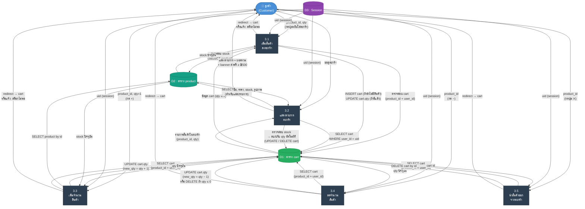

# DFD Level 2 — Process 3: ระบบจัดการตะกร้าสินค้า

> อ้างอิงจากโค้ดจริงในระบบ: `pages/product.php`, `pages/cart.php`, `pages/cart-increase.php`, `pages/cart-decrease.php`, `pages/cart-remove.php`

---

## ภาพรวม Sub-Processes

| # | กระบวนการ | ไฟล์อ้างอิง |
|---|-----------|-------------|
| **3.1** | เพิ่มสินค้าลงตะกร้า (Add to Cart) | `pages/product.php` + `pages/cart-increase.php` |
| **3.2** | แสดงรายการตะกร้า (View Cart) | `pages/cart.php` |
| **3.3** | เพิ่มจำนวนสินค้าในตะกร้า (Increase Qty) | `pages/cart-increase.php` |
| **3.4** | ลดจำนวนสินค้าในตะกร้า (Decrease Qty) | `pages/cart-decrease.php` |
| **3.5** | นำสินค้าออกจากตะกร้า (Remove Item) | `pages/cart-remove.php` |

---

## External Entities

| สัญลักษณ์ | ชื่อ | บทบาท |
|-----------|------|--------|
| **E1** | ลูกค้า (Customer) | ผู้ใช้งานระบบตะกร้าสินค้าทั้งหมด (ต้อง login ก่อน) |

---

## Data Stores

| สัญลักษณ์ | ชื่อ DB Table | ฟิลด์หลัก |
|-----------|--------------|-----------|
| **D1** | `cart` | `id`, `user_id`, `product_id`, `qty` |
| **D2** | `product` | `id`, `name`, `price`, `stock`, `img`, `type_id` |
| **D3** | `session` | `uid` (PHP Session) |

---

## แผนภาพ DFD Level 2



---

## รายละเอียด Sub-Processes

### 3.1 เพิ่มสินค้าลงตะกร้า
> ไฟล์: `pages/product.php` (UI) + `pages/cart-increase.php` (logic)

| Flow | รายละเอียด |
|------|-----------|
| **Input** | `product_id`, `qty` (จาก quantity picker), `uid` จาก Session |
| **Validation** | ตรวจสอบ `is_auth()` — ถ้าไม่ login จะ redirect ไป `?page=login` |
| **Stock Check** | SELECT `product.stock` → ต้องมี stock > 0 |
| **Cart Check** | ถ้าสินค้าอยู่ในตะกร้าแล้ว → `new_qty = cart.qty + qty` แล้วตรวจ `new_qty <= stock` |
| **Process** | **กรณีใหม่:** INSERT cart(`user_id`, `product_id`, `qty`) / **กรณีมีแล้ว:** UPDATE cart.qty |
| **Output** | redirect → `cart.php` หรือ `show_alert('จำนวนสินค้าในสต๊อกไม่เพียงพอ')` |

> [!NOTE]
> หน้า `product.php` คำนวณ `product_stock = product.stock − cart.qty` เพื่อ disable ปุ่ม + เมื่อถึงขีดจำกัด

---

### 3.2 แสดงรายการตะกร้า
> ไฟล์: `pages/cart.php`

| Flow | รายละเอียด |
|------|-----------|
| **Input** | `uid` จาก Session |
| **Validation** | ตรวจสอบ `is_auth()` — ถ้าไม่ login จะ redirect ไป `home` |
| **Auto-Fix Logic** | Loop ทุก item → ถ้า product ถูกลบแล้ว → DELETE cart / ถ้า `stock < qty` → UPDATE qty = stock / ถ้า `stock < 1` → DELETE cart |
| **Alert** | ถ้ามีการแก้ไขอัตโนมัติ → `show_alert('สินค้าในตะกร้ามีการเปลี่ยนแปลง!')` |
| **Process** | ดึงข้อมูลสินค้าแต่ละรายการ → คำนวณ `total = Σ(price × qty)` |
| **Free Shipping** | ถ้า `total >= 500` → จัดส่งฟรี / ถ้า `total < 500` → แสดง "ซื้อเพิ่มอีก ฿X รับส่งฟรี" |
| **Output** | หน้ารายการตะกร้า + ยอดรวม + ปุ่ม "ดำเนินการต่อ" (→ confirm.php) |

> [!IMPORTANT]
> ปุ่ม "ดำเนินการต่อ" จะ **disabled** อัตโนมัติถ้า `cart_count < 1`

---

### 3.3 เพิ่มจำนวนสินค้า
> ไฟล์: `pages/cart-increase.php`

| Flow | รายละเอียด |
|------|-----------|
| **Input** | `product_id`, `qty = 1`, `uid` จาก Session |
| **Method** | POST only (`$_SERVER['REQUEST_METHOD'] == 'POST'`) |
| **Validation** | ตรวจ `is_auth()` + `product_id != ''` + `qty != ''` |
| **Process** | SELECT cart → SELECT product.stock → คำนวณ `new_qty = cart.qty + 1` → ตรวจ `new_qty <= stock` → UPDATE cart.qty |
| **Output** | redirect → `cart.php` หรือ `show_alert('จำนวนสินค้าในสต๊อกไม่เพียงพอ')` |

---

### 3.4 ลดจำนวนสินค้า
> ไฟล์: `pages/cart-decrease.php`

| Flow | รายละเอียด |
|------|-----------|
| **Input** | `product_id`, `uid` จาก Session |
| **Method** | POST only |
| **Process** | SELECT cart → คำนวณ `new_qty = cart.qty − 1` |
| **Branch** | ถ้า `new_qty <= 0` → **DELETE** cart item / ถ้า `new_qty > 0` → **UPDATE** cart.qty = new_qty |
| **Output** | redirect → `cart.php` |

---

### 3.5 นำสินค้าออกจากตะกร้า
> ไฟล์: `pages/cart-remove.php`

| Flow | รายละเอียด |
|------|-----------|
| **Input** | `product_id`, `uid` จาก Session |
| **Method** | POST only |
| **Process** | SELECT cart (product_id + user_id) → ถ้าพบ → DELETE cart by id |
| **Output** | redirect → `cart.php` |

---

## Data Dictionary

### ตาราง `cart` (D1)
| ฟิลด์ | ประเภทข้อมูล | คำอธิบาย |
|-------|-------------|----------|
| `id` | INT (PK) | รหัสรายการในตะกร้า |
| `user_id` | INT (FK) | อ้างอิง `user.id` (เจ้าของตะกร้า) |
| `product_id` | INT (FK) | อ้างอิง `product.id` (สินค้าในตะกร้า) |
| `qty` | INT | จำนวนที่ต้องการสั่งซื้อ |

### ตาราง `product` (D2)
| ฟิลด์ | ประเภทข้อมูล | คำอธิบาย |
|-------|-------------|----------|
| `id` | INT (PK) | รหัสสินค้า |
| `name` | VARCHAR(255) | ชื่อสินค้า |
| `price` | DECIMAL(10,2) | ราคาสินค้า |
| `stock` | INT | จำนวนสินค้าคงคลัง |
| `img` | VARCHAR | ชื่อไฟล์รูปภาพ |
| `type_id` | INT (FK) | หมวดหมู่สินค้า |

### D3 : PHP Session
| Key | ประเภท | คำอธิบาย |
|-----|--------|----------|
| `uid` | INT | รหัสผู้ใช้ที่ login อยู่ (ใช้ระบุเจ้าของตะกร้า) |

---

## สรุป Data Flows หลัก

```
ลูกค้า ──[product_id, qty]──► 3.1 ──ตรวจสอบ stock──► D2 (product)
                               3.1 ──INSERT/UPDATE──► D1 (cart)
                               3.1 ◄─── uid ────────── D3 (session)

ลูกค้า ──[ขอดูตะกร้า]──► 3.2 ──SELECT cart──► D1 (cart)
                           3.2 ──SELECT product──► D2 (product)
                           3.2 ──Auto-fix UPDATE/DELETE──► D1 (cart)

ลูกค้า ──[product_id, qty=1]──► 3.3 ──UPDATE cart.qty──► D1 (cart)
                                 3.3 ──ตรวจ stock──► D2 (product)

ลูกค้า ──[product_id]──► 3.4 ──UPDATE qty / DELETE──► D1 (cart)

ลูกค้า ──[product_id]──► 3.5 ──DELETE cart by id──► D1 (cart)
```

---

## Logic พิเศษในระบบ

| Feature | รายละเอียด |
|---------|-----------|
| **Stock Guard (cart.php)** | ทุกครั้งที่โหลดหน้าตะกร้า ระบบจะตรวจ stock ล่าสุดและปรับ qty/ลบสินค้าอัตโนมัติ |
| **Free Shipping Banner** | แสดง progress เมื่อ `total < ฿500` และเปลี่ยนเป็น "ได้รับสิทธิ์ส่งฟรี" เมื่อ `total >= ฿500` |
| **Qty Picker (product.php)** | JavaScript คำนวณ `available = stock − cart.qty` เพื่อ disable ปุ่ม + ไม่ให้เลือกเกิน stock จริง |
| **Auth Guard** | ทุก process ต้องตรวจ `is_auth()` ก่อน — ถ้าไม่ login จะ redirect ทันที |
| **Duplicate Prevention** | 3.1 ตรวจว่า product มีในตะกร้าแล้วหรือไม่ → INSERT ถ้าใหม่, UPDATE ถ้ามีแล้ว (ไม่สร้าง row ซ้ำ) |
