# DFD Level 2 — Process 4: ระบบจัดการคำสั่งซื้อ

> อ้างอิงจากโค้ดจริงในระบบ: `pages/confirm.php`, `pages/payment.php`, `pages/order-detail.php`, `pages/order-history.php`

---

## ภาพรวม Sub-Processes

| #       | กระบวนการ                                         | ไฟล์อ้างอิง                                           |
| ------- | ------------------------------------------------- | ----------------------------------------------------- |
| **4.1** | ยืนยันการสั่งซื้อ (Place Order)                   | `pages/confirm.php`                                   |
| **4.2** | แจ้งชำระเงิน (Submit Payment)                     | `pages/payment.php`                                   |
| **4.3** | ดูรายละเอียดคำสั่งซื้อ (View Order Detail)        | `pages/order-detail.php`                              |
| **4.4** | ดูประวัติการสั่งซื้อ (View Order History)         | `pages/order-history.php`                             |
| **4.5** | ยกเลิกคำสั่งซื้อ [ลูกค้า] (Cancel Order)          | `pages/order-detail.php` (POST)                       |
| **4.6** | ดูรายละเอียดคำสั่งซื้อ [Admin] (Admin View Order) | `admin/pages/order.php`                               |
| **4.8** | อัปเดตสถานะคำสั่งซื้อ (Update Order Status)       | `admin/pages/order.php` (POST)                        |
| **4.9** | พิมพ์ใบเสร็จ (Print Receipt)                      | `admin/pages/order.php` + `core/helpers/get_data.php` |

---

## External Entities

| สัญลักษณ์ | ชื่อ              | บทบาท                                                |
| --------- | ----------------- | ---------------------------------------------------- |
| **E1**    | ลูกค้า (Customer) | ผู้สั่งซื้อ, ชำระเงิน, ติดตามสถานะ, ยกเลิกคำสั่งซื้อ |
| **E2**    | แอดมิน (Admin)    | ตรวจสอบสลิป, อัปเดตสถานะการจัดส่ง, จัดการคำสั่งซื้อ  |

---

## Data Stores

| สัญลักษณ์ | ชื่อ DB Table  | ฟิลด์หลัก                                                                                                                               |
| --------- | -------------- | --------------------------------------------------------------------------------------------------------------------------------------- |
| **D1**    | `order`        | `id`, `user_id`, `name`, `phone`, `address`, `total_price`, `delivery_fee`, `delivery_type`, `status`, `tracking`, `note`, `order_date` |
| **D2**    | `order_detail` | `id`, `order_id`, `product_id`, `product_name`, `product_price`, `product_img`, `qty`                                                   |
| **D3**    | `product`      | `id`, `name`, `price`, `stock`, `img`                                                                                                   |
| **D4**    | `cart`         | `id`, `user_id`, `product_id`, `qty`                                                                                                    |
| **D5**    | `payment`      | `id`, `order_id`, `bank_id`, `pay_date`, `pay_time`, `img`, `submit_date`                                                               |
| **D6**    | `bank`         | `id`, `type`, `name`, `number`                                                                                                          |
| **D7**    | `session`      | `uid` (PHP Session)                                                                                                                     |

---

## Order Status Flow

```
status = 0  →  ❌ ยกเลิก
status = 1  →  ⏳ รอชำระเงิน    (สร้างใหม่จาก confirm.php)
status = 2  →  🔍 รอตรวจสอบ    (หลัง upload สลิปใน payment.php)
status = 3  →  📦 รอจัดส่ง     (admin อนุมัติสลิป)
status = 4  →  ✅ จัดส่งสำเร็จ (admin อัปเดตหลังจัดส่ง)
```

---

## แผนภาพ DFD Level 2

```mermaid
%%{init: {'flowchart': {'rankDir': 'TD'}}}%%
flowchart TD
    E1(["👤 ลูกค้า"])
    E2(["🔧 แอดมิน"])

    D1[("D1: order")]
    D2[("D2: order_detail")]
    D3[("D3: product")]
    D4[("D4: cart")]
    D5[("D5: payment")]
    D6[("D6: bank")]
    D7[("D7: Session")]

    P41["4.1 ยืนยัน\nการสั่งซื้อ"]
    P42["4.2 แจ้ง\nชำระเงิน"]
    P43["4.3 ดูรายละเอียด\nOrder (ลูกค้า)"]
    P44["4.4 ดูประวัติ\nการสั่งซื้อ"]
    P45["4.5 ยกเลิก\nOrder (ลูกค้า)"]
    P46["4.6 ดูรายละเอียด\nOrder (Admin)"]
    P47["4.7 ตรวจสอบ\nการชำระเงิน"]
    P48["4.8 อัปเดต\nสถานะ Order"]
    P49["4.9 พิมพ์\nใบเสร็จ"]

    %% ─── 4.1 ───
    E1 -->|"ที่อยู่, delivery_type"| P41
    D7 -->|"uid"| P41
    P41 -->|"SELECT cart"| D4
    D4 -->|"product_id, qty"| P41
    P41 -->|"SELECT product stock"| D3
    D3 -->|"stock, price"| P41
    P41 -->|"INSERT order (status=1)"| D1
    P41 -->|"INSERT order_detail"| D2
    P41 -->|"UPDATE product.stock"| D3
    P41 -->|"DELETE cart"| D4
    P41 -->|"redirect → payment"| E1

    %% ─── 4.2 ───
    E1 -->|"slip, bank_id, pay_date"| P42
    D7 -->|"uid"| P42
    P42 -->|"SELECT order (status=1)"| D1
    P42 -->|"SELECT bank"| D6
    D6 -->|"ข้อมูลธนาคาร"| P42
    P42 -->|"INSERT payment"| D5
    P42 -->|"UPDATE order.status=2"| D1
    P42 -->|"redirect → order-detail"| E1

    %% ─── 4.3 ───
    E1 -->|"order_id"| P43
    D7 -->|"uid"| P43
    P43 -->|"SELECT order"| D1
    P43 -->|"SELECT order_detail"| D2
    D1 -->|"status, tracking"| P43
    D2 -->|"รายการสินค้า"| P43
    P43 -->|"แสดงรายละเอียด"| E1

    %% ─── 4.4 ───
    E1 -->|"ขอดูประวัติ"| P44
    D7 -->|"uid"| P44
    P44 -->|"SELECT orders WHERE user_id"| D1
    D1 -->|"รายการ orders"| P44
    P44 -->|"แสดง tab ตาม status"| E1

    %% ─── 4.5 ───
    E1 -->|"cancel_order (status=1 only)"| P45
    P45 -->|"SELECT order"| D1
    P45 -->|"UPDATE order.status=0"| D1
    P45 -->|"แจ้งยกเลิกสำเร็จ"| E1

    %% ─── 4.6 Admin View ───
    E2 -->|"?id=order_id"| P46
    P46 -->|"SELECT order JOIN user"| D1
    P46 -->|"SELECT order_detail"| D2
    P46 -->|"SELECT payment JOIN bank"| D5
    D1 -->|"order + user info"| P46
    D2 -->|"รายการสินค้า"| P46
    D5 -->|"ข้อมูลสลิป"| P46
    P46 -->|"แสดงหน้า order detail"| E2

    %% ─── 4.7 Verify Payment ───
    E2 -->|"approve / reject"| P47
    P47 -->|"UPDATE order.status=3 (approve)"| D1
    P47 -->|"UPDATE order.status=1 + note (reject)"| D1
    P47 -->|"reload page"| E2

    %% ─── 4.8 Update Status ───
    E2 -->|"status, tracking, note,\ncancel_and_restock"| P48
    P48 -->|"SELECT order_detail (ถ้า cancel+restock)"| D2
    D2 -->|"product_id, qty"| P48
    P48 -->|"UPDATE product.stock + qty (restock)"| D3
    P48 -->|"UPDATE order (status, tracking, note)"| D1
    P48 -->|"reload page"| E2

    %% ─── 4.9 Print Receipt ───
    E2 -->|"printOrder(id)"| P49
    P49 -->|"GET /core/helpers/get_data.php"| D1
    P49 -->|"GET order_detail"| D2
    P49 -->|"GET payment + bank"| D5
    D1 -->|"order data"| P49
    D2 -->|"items"| P49
    D5 -->|"payment info"| P49
    P49 -->|"render ใบเสร็จ (A4)"| E2

    %% Styling
    style E1  fill:#4A90D9,color:#fff,stroke:#2c6fad
    style E2  fill:#E67E22,color:#fff,stroke:#b35a00
    style D1  fill:#27AE60,color:#fff,stroke:#1a7a43
    style D2  fill:#16A085,color:#fff,stroke:#0e6b58
    style D3  fill:#8E44AD,color:#fff,stroke:#6c2d8a
    style D4  fill:#2980B9,color:#fff,stroke:#1a5f8a
    style D5  fill:#C0392B,color:#fff,stroke:#8e1b12
    style D6  fill:#7F8C8D,color:#fff,stroke:#555f60
    style D7  fill:#D35400,color:#fff,stroke:#9a3d00
    style P41 fill:#2C3E50,color:#fff,stroke:#1a252f
    style P42 fill:#2C3E50,color:#fff,stroke:#1a252f
    style P43 fill:#2C3E50,color:#fff,stroke:#1a252f
    style P44 fill:#2C3E50,color:#fff,stroke:#1a252f
    style P45 fill:#2C3E50,color:#fff,stroke:#1a252f
    style P46 fill:#922B21,color:#fff,stroke:#6b1e18
    style P47 fill:#922B21,color:#fff,stroke:#6b1e18
    style P48 fill:#922B21,color:#fff,stroke:#6b1e18
    style P49 fill:#922B21,color:#fff,stroke:#6b1e18
```



---

## รายละเอียด Sub-Processes

### 4.1 ยืนยันการสั่งซื้อ

> ไฟล์: `pages/confirm.php`

| Flow                    | รายละเอียด                                                                                                         |
| ----------------------- | ------------------------------------------------------------------------------------------------------------------ |
| **Input**               | `firstname`, `lastname`, `phone`, `address`, `delivery_type`, `uid` จาก Session                                    |
| **Auth Guard**          | ตรวจสอบ `is_auth()` — ถ้าไม่ login redirect → `home`                                                               |
| **Cart Check**          | ถ้า `cart_count == 0` → redirect → `home` (ป้องกันสั่งซื้อตะกร้าว่าง)                                              |
| **Stock Validation**    | loop ทุก item → ตรวจ `product.stock < item.qty` หรือ `stock < 1` → redirect → cart                                 |
| **Delivery Fee**        | `delivery_type=1` (ไปรษณีย์): ฟรีถ้า `total ≥ ฿500` / ฿50 ถ้า `total < ฿500` / `delivery_type=2` (รับเอง): ฟรีเสมอ |
| **INSERT order**        | บันทึก `user_id, name, phone, address, total_price, delivery_fee, delivery_type, status=1, order_date`             |
| **INSERT order_detail** | บันทึกทุก item: `order_id, product_id, product_name, product_price, product_img, qty` (snapshot ณ เวลาสั่ง)        |
| **UPDATE stock**        | `product.stock = product.stock − item.qty` สำหรับทุก item                                                          |
| **DELETE cart**         | `DELETE cart WHERE user_id = uid` (ล้างตะกร้าทั้งหมด)                                                              |
| **Output**              | redirect → `payment?order_id={id}`                                                                                 |

> [!IMPORTANT]
> `order_detail` บันทึก `product_name`, `product_price`, `product_img` แบบ **snapshot** เพื่อรักษาข้อมูลณ เวลาที่สั่ง แม้สินค้าจะถูกแก้ไขในภายหลัง

---

### 4.2 แจ้งชำระเงิน

> ไฟล์: `pages/payment.php`

| Flow                | รายละเอียด                                                                                |
| ------------------- | ----------------------------------------------------------------------------------------- |
| **Input**           | `slip` (image file), `pay_date`, `pay_time`, `bank_id`, `order_id` (GET), `uid` (Session) |
| **Auth Guard**      | ตรวจสอบ `is_auth()` + `order.user_id == uid` + `order.status == 1`                        |
| **File Validation** | `is_image($slip)` — รองรับ JPG, JPEG, PNG, GIF, WEBP เท่านั้น                             |
| **Upload**          | `generate_image_name()` → `upload_image()` → บันทึกไปที่ `upload/payment/`                |
| **INSERT payment**  | `order_id, bank_id, pay_date, pay_time, img (filename), submit_date`                      |
| **UPDATE order**    | `order.status = 2` (รอตรวจสอบ)                                                            |
| **Output**          | redirect → `order-detail?order_id={id}`                                                   |

> [!NOTE]
> หน้านี้จะ **redirect → home** ถ้า `order.status ≠ 1` — ป้องกันการแจ้งโอนซ้ำสำหรับ order ที่ดำเนินการแล้ว

---

### 4.3 ดูรายละเอียดคำสั่งซื้อ

> ไฟล์: `pages/order-detail.php`

| Flow               | รายละเอียด                                                                    |
| ------------------ | ----------------------------------------------------------------------------- |
| **Input**          | `order_id` (GET), `uid` (Session)                                             |
| **Auth Guard**     | ตรวจสอบ `is_auth()` + `order.user_id == uid`                                  |
| **Data Fetch**     | SELECT `order` + SELECT `order_detail WHERE order_id`                         |
| **Status Display** | Progress bar: รอดำเนินการ → เตรียมการจัดส่ง → จัดส่งแล้ว                      |
| **Cancel Button**  | แสดงปุ่ม "ยกเลิกคำสั่งซื้อ" เฉพาะเมื่อ `status == 1`                          |
| **Payment Button** | แสดงปุ่ม "ชำระเงิน" → payment.php เฉพาะเมื่อ `status == 1`                    |
| **Tracking**       | แสดง tracking number + ลิงก์ไปรษณีย์ไทย เมื่อ `status == 4` หรือมี `tracking` |
| **Output**         | แสดงข้อมูล order ครบถ้วน + รายการสินค้า + ที่อยู่ + สรุปยอด                   |

---

### 4.4 ดูประวัติการสั่งซื้อ

> ไฟล์: `pages/order-history.php`

| Flow           | รายละเอียด                                                                                              |
| -------------- | ------------------------------------------------------------------------------------------------------- |
| **Input**      | `uid` (Session)                                                                                         |
| **Auth Guard** | ตรวจสอบ `is_auth()`                                                                                     |
| **Data Fetch** | `SELECT * FROM order WHERE user_id = uid ORDER BY order_date DESC`                                      |
| **Tab Filter** | JavaScript แบ่ง tab: ทั้งหมด / ที่ต้องชำระ (1) / รอตรวจสอบ (2) / รอจัดส่ง (3) / สำเร็จ (4) / ยกเลิก (0) |
| **Display**    | แสดง: #ORDER-id, วันที่, สถานะ, tracking, ยอดรวม, ลิงก์ไป order-detail                                  |
| **Output**     | หน้ารายการ orders ทั้งหมดพร้อม tab navigation                                                           |

---

### 4.5 ยกเลิกคำสั่งซื้อ

> ไฟล์: `pages/order-detail.php` (POST handler)

| Flow        | รายละเอียด                                                                       |
| ----------- | -------------------------------------------------------------------------------- |
| **Input**   | `cancel_order=true` (POST hidden field), `order_id` (GET), `uid` (Session)       |
| **Method**  | POST only — ต้องมี `$_POST['cancel_order']`                                      |
| **Guard**   | เฉพาะ order ที่ `status == 1` เท่านั้นที่ปุ่มจะปรากฏให้กด                        |
| **Process** | `UPDATE order SET status = 0 WHERE id = order_id`                                |
| **Output**  | redirect → `order-detail?order_id={id}` + `show_alert('ยกเลิกคำสั่งซื้อสำเร็จ')` |

> [!WARNING]
> การยกเลิกคำสั่งซื้อ **ไม่ได้คืนสต็อกสินค้าอัตโนมัติ** ในระบบนี้ — stock ถูกหักตั้งแต่ตอน 4.1 confirm.php และไม่มี logic restore เมื่อ cancel

---

## Data Dictionary

### ตาราง `order` (D1)

| ฟิลด์           | ประเภทข้อมูล | คำอธิบาย                                              |
| --------------- | ------------ | ----------------------------------------------------- |
| `id`            | INT (PK)     | รหัสคำสั่งซื้อ                                        |
| `user_id`       | INT (FK)     | อ้างอิง `user.id`                                     |
| `name`          | VARCHAR      | ชื่อ-นามสกุลผู้รับ                                    |
| `phone`         | VARCHAR      | เบอร์โทรผู้รับ                                        |
| `address`       | TEXT         | ที่อยู่จัดส่ง                                         |
| `total_price`   | DECIMAL      | ราคาสินค้ารวม                                         |
| `delivery_fee`  | DECIMAL      | ค่าจัดส่ง (0 หรือ 50)                                 |
| `delivery_type` | INT          | 1=ไปรษณีย์, 2=รับเอง                                  |
| `status`        | INT          | 0=ยกเลิก, 1=รอชำระ, 2=รอตรวจสอบ, 3=รอจัดส่ง, 4=สำเร็จ |
| `tracking`      | VARCHAR      | เลขพัสดุไปรษณีย์ไทย                                   |
| `note`          | TEXT         | หมายเหตุจาก admin                                     |
| `order_date`    | DATETIME     | วันเวลาที่สั่งซื้อ                                    |

### ตาราง `order_detail` (D2)

| ฟิลด์           | ประเภทข้อมูล | คำอธิบาย                |
| --------------- | ------------ | ----------------------- |
| `id`            | INT (PK)     | รหัสรายการ              |
| `order_id`      | INT (FK)     | อ้างอิง `order.id`      |
| `product_id`    | INT (FK)     | อ้างอิง `product.id`    |
| `product_name`  | VARCHAR      | ชื่อสินค้า (snapshot)   |
| `product_price` | DECIMAL      | ราคาสินค้า (snapshot)   |
| `product_img`   | VARCHAR      | รูปภาพสินค้า (snapshot) |
| `qty`           | INT          | จำนวนที่สั่งซื้อ        |

### ตาราง `payment` (D5)

| ฟิลด์         | ประเภทข้อมูล | คำอธิบาย            |
| ------------- | ------------ | ------------------- |
| `id`          | INT (PK)     | รหัสการชำระเงิน     |
| `order_id`    | INT (FK)     | อ้างอิง `order.id`  |
| `bank_id`     | INT          | ประเภทธนาคาร (1–10) |
| `pay_date`    | DATE         | วันที่โอนเงิน       |
| `pay_time`    | TIME         | เวลาโอนเงิน         |
| `img`         | VARCHAR      | ชื่อไฟล์สลิป        |
| `submit_date` | DATETIME     | วันเวลาที่แจ้งโอน   |

---

## สรุป Data Flows หลัก

```
ลูกค้า ──[ที่อยู่, delivery_type]──► 4.1 ──ตรวจ stock──► D3 (product)
                                      4.1 ──ดึง cart──► D4 (cart)
                                      4.1 ──INSERT──► D1 (order)
                                      4.1 ──INSERT──► D2 (order_detail)
                                      4.1 ──UPDATE stock──► D3 (product)
                                      4.1 ──DELETE cart──► D4 (cart)

ลูกค้า ──[slip, bank, วันเวลา]──► 4.2 ──INSERT──► D5 (payment)
                                    4.2 ──UPDATE status=2──► D1 (order)

ลูกค้า ──[order_id]──► 4.3 ──SELECT order──► D1 (order)
                         4.3 ──SELECT items──► D2 (order_detail)

ลูกค้า ──[ขอดูประวัติ]──► 4.4 ──SELECT orders──► D1 (order)

ลูกค้า ──[cancel_order]──► 4.5 ──UPDATE status=0──► D1 (order)

แอดมิน ──[order_id]──► 4.6 ──SELECT order + user──► D1 (order), D7 (user)
                         4.6 ──SELECT items──► D2 (order_detail)
                         4.6 ──SELECT payment──► D5 (payment)

แอดมิน ──[approve/reject]──► 4.7 ──UPDATE status=3 หรือ 1──► D1 (order)

แอดมิน ──[status, tracking, note]──► 4.8 ──UPDATE order──► D1 (order)
แอดมิน ──[cancel_and_restock]──► 4.8 ──UPDATE stock──► D3 (product)

แอดมิน ──[print_order]──► 4.9 ──GET order data──► D1, D2, D5
```

---

---

## Admin Sub-Processes (จาก `admin/pages/order.php`)

### 4.6 ดูรายละเอียดคำสั่งซื้อ [Admin]

| Flow        | รายละเอียด                                                                                                                       |
| ----------- | -------------------------------------------------------------------------------------------------------------------------------- |
| **Query**   | `SELECT o.*, u.firstname, u.lastname, u.email, u.phone FROM order o LEFT JOIN user u ON o.user_id = u.id WHERE o.id = $order_id` |
| **Items**   | `SELECT * FROM order_detail WHERE order_id = $order_id`                                                                          |
| **Payment** | `SELECT p.*, b.name as bank_name FROM payment p LEFT JOIN bank b ON p.bank_id = b.id WHERE p.order_id = $order_id`               |
| **Output**  | แสดง: progress bar สถานะ, ข้อมูลลูกค้า, ที่อยู่จัดส่ง, รายการสินค้า, ข้อมูลการชำระเงิน, สลิปโอนเงิน                              |

---

### 4.8 อัปเดตสถานะ Order (Manual)

| Flow               | รายละเอียด                                                                                                                       |
| ------------------ | -------------------------------------------------------------------------------------------------------------------------------- |
| **Input**          | `status` (0–4), `tracking`, `note`, `cancel_and_restock` (checkbox)                                                              |
| **Restock Logic**  | ถ้า `status=0 && cancel_and_restock=true` → `SELECT order_detail` → loop `UPDATE product.stock = stock + qty` (คืนสต็อกทุก item) |
| **Update**         | `UPDATE order SET status, tracking, note WHERE id = order_id`                                                                    |
| **Tracking Field** | แสดง input เลขพัสดุเฉพาะเมื่อ `status >= 3` และ `delivery_type=1`                                                                |

> [!IMPORTANT]
> Admin สามารถอัปเดต status ได้ทุกค่า (0–4) แบบ manual ผ่าน Modal — แตกต่างจากลูกค้าที่ทำได้เฉพาะยกเลิก (0)

---

### 4.9 พิมพ์ใบเสร็จ

| Flow        | รายละเอียด                                                                                                  |
| ----------- | ----------------------------------------------------------------------------------------------------------- |
| **Trigger** | กดปุ่ม "พิมพ์" → JS `printOrder(orderId)`                                                                   |
| **Fetch**   | `GET ../core/helpers/get_data.php?type=order&id={orderId}` → ได้ JSON: `order`, `items`, `payment`, `buyer` |
| **Render**  | สร้าง HTML ใบเสร็จ A4 ใน Modal (ชื่อ-ที่อยู่, ตารางสินค้า, สรุปยอด, ข้อมูลชำระเงิน)                         |
| **Print**   | `window.print()` พร้อม `@media print` CSS ซ่อน sidebar/navbar แสดงเฉพาะ modal content                       |

---

## Logic พิเศษในระบบ

| Feature                   | รายละเอียด                                                                                                |
| ------------------------- | --------------------------------------------------------------------------------------------------------- |
| **Snapshot Order Detail** | `order_detail` บันทึก `product_name, price, img` ณ เวลาสั่ง — ข้อมูลไม่เปลี่ยนแม้แก้ไขสินค้าทีหลัง        |
| **Free Shipping Logic**   | `total ≥ ฿500` + `delivery_type=1` → `delivery_fee = 0` / ต่ำกว่า → `delivery_fee = 50`                   |
| **VAT Calculation**       | ราคาก่อนภาษี = `(total + fee) × 100/107` / VAT = `(total + fee) × 7/107`                                  |
| **Cancel Guard**          | ปุ่มยกเลิกแสดงเฉพาะ `status == 1` — ไม่สามารถยกเลิก order ที่แจ้งโอนแล้ว                                  |
| **Payment Guard**         | `payment.php` ตรวจ `order.status == 1` — ถ้าไม่ใช่จะ redirect ทันที ป้องกันแจ้งซ้ำ                        |
| **Tab Navigation**        | `order-history.php` ใช้ Bootstrap Tab แบ่ง 6 กลุ่มสถานะ — filter ฝั่ง client (ดึงข้อมูลทั้งหมดครั้งเดียว) |
| **Tracking Integration**  | ลิงก์ติดตามพัสดุไปยัง `track.thailandpost.co.th` เมื่อมี tracking number                                  |
