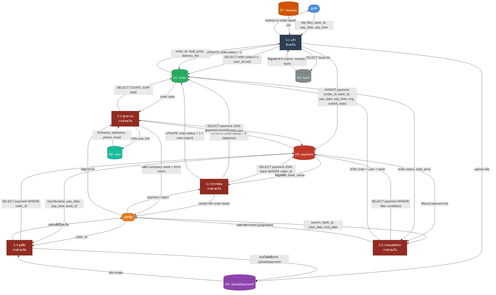

# DFD Level 2 — Process 5: ระบบจัดการการชำระเงิน

> อ้างอิงจากโค้ดจริงในระบบ: `pages/payment.php`, `admin/pages/report-payments.php`, `admin/pages/order.php`

---

## ภาพรวม Sub-Processes

| #       | กระบวนการ                                                    | ไฟล์อ้างอิง                      |
| ------- | ------------------------------------------------------------ | --------------------------------- |
| **5.1** | แจ้งชำระเงิน (Submit Payment Slip)                           | `pages/payment.php`               |
| **5.2** | ตรวจสอบ / อนุมัติ / ปฏิเสธการชำระเงิน (Verify Payment)      | `admin/pages/order.php` (POST)    |
| **5.3** | ดูรายงานการแจ้งชำระเงิน (View Payment Report)               | `admin/pages/report-payments.php` |
| **5.4** | ดูสลิปการชำระเงิน (View Payment Slip)                        | `admin/pages/order.php` (GET)     |
| **5.5** | กรองและค้นหาการชำระเงิน (Filter & Search Payments)          | `admin/pages/report-payments.php` |

---

## External Entities

| สัญลักษณ์ | ชื่อ              | บทบาท                                                         |
| --------- | ----------------- | ------------------------------------------------------------- |
| **E1**    | ลูกค้า (Customer) | แจ้งชำระเงิน, อัปโหลดสลิปโอนเงิน                             |
| **E2**    | แอดมิน (Admin)    | ตรวจสอบสลิป, อนุมัติ/ปฏิเสธการชำระ, ดูรายงาน, กรองค้นหาข้อมูล |

---

## Data Stores

| สัญลักษณ์ | ชื่อ DB Table | ฟิลด์หลัก                                                                      |
| --------- | ------------- | ------------------------------------------------------------------------------ |
| **D1**    | `order`       | `id`, `user_id`, `total_price`, `delivery_fee`, `status`, `note`, `order_date` |
| **D5**    | `payment`     | `id`, `order_id`, `bank_id`, `pay_date`, `pay_time`, `img`, `submit_date`      |
| **D6**    | `bank`        | `id`, `type`, `name`, `number`                                                 |
| **D7**    | `session`     | `uid` (PHP Session)                                                             |
| **D8**    | `user`        | `id`, `firstname`, `lastname`, `email`, `phone`                                |
| **D9**    | `upload`      | ไฟล์สลิปใน `upload/payment/` (filesystem)                                      |

---

## Payment Status Flow

```
order.status = 1  →  รอชำระเงิน    (สร้างจาก confirm.php)
                          ↓  ลูกค้า upload สลิป (5.1)
order.status = 2  →  รอตรวจสอบ    (หลัง insert payment)
                          ↓  admin อนุมัติ (5.2)
order.status = 3  →  รอจัดส่ง     (approve)
                    ↖ กลับเป็น 1     (reject — admin ปฏิเสธ)
```

---

## แผนภาพ DFD Level 2



> **หมายเหตุสี:**
> - กล่องสีน้ำเงินเข้ม (`#2C3E50`) = Sub-process ฝั่งลูกค้า
> - กล่องสีแดงเข้ม (`#922B21`) = Sub-process ฝั่งแอดมิน

---

## รายละเอียด Sub-Processes

### 5.1 แจ้งชำระเงิน

> ไฟล์: `pages/payment.php`

| Flow                | รายละเอียด                                                                                 |
| ------------------- | ------------------------------------------------------------------------------------------ |
| **Input**           | `slip` (image file), `bank_id`, `pay_date`, `pay_time`, `order_id` (GET), `uid` (Session) |
| **Auth Guard**      | ตรวจสอบ `is_auth()` — ถ้าไม่ login redirect → `home`                                       |
| **Order Guard**     | ตรวจสอบ `order.user_id == uid` AND `order.status == 1` — ถ้าไม่ตรง redirect → `home`      |
| **File Validation** | `is_image($slip)` — รองรับ JPG, JPEG, PNG, GIF, WEBP เท่านั้น                              |
| **Upload**          | `generate_image_name()` → `upload_image($slip, $name, 'payment/')` → บันทึกใน D9          |
| **INSERT payment**  | `order_id, bank_id, pay_date, pay_time, img (filename), submit_date = NOW()`              |
| **UPDATE order**    | `order.status = 2` (รอตรวจสอบ)                                                             |
| **UI Feature**      | Preview สลิปผ่าน `FileReader` API ก่อน submit                                              |
| **Output**          | redirect → `order-detail?order_id={id}`                                                   |

> [!NOTE]
> `payment.php` จะ **redirect → home ทันที** ถ้า `order.status != 1` เพื่อป้องกันการแจ้งโอนซ้ำสำหรับ order ที่ดำเนินการแล้ว

---

### 5.2 ตรวจสอบการชำระเงิน

> ไฟล์: `admin/pages/order.php` (POST handler)

| Flow             | รายละเอียด                                                                                      |
| ---------------- | ----------------------------------------------------------------------------------------------- |
| **Input**        | `action = approve` หรือ `action = reject`, `order_id`, `note` (กรณี reject)                    |
| **Auth Guard**   | เฉพาะ admin เท่านั้น (`is_admin()`)                                                             |
| **Data Fetch**   | `SELECT p.*, b.name FROM payment p LEFT JOIN bank b ON p.bank_id = b.id WHERE p.order_id = ?`  |
| **Approve Flow** | `UPDATE order SET status = 3 WHERE id = order_id`                                              |
| **Reject Flow**  | `UPDATE order SET status = 1, note = $note WHERE id = order_id`                                |
| **Output**       | reload หน้า order detail พร้อม feedback สถานะ                                                  |

> [!IMPORTANT]
> เมื่อ admin **ปฏิเสธ** (reject) สลิป — `order.status` จะถูก reset กลับเป็น `1` (รอชำระเงิน) และ record ใน `payment` table ยังคงอยู่ ลูกค้าจะต้องแจ้งชำระใหม่อีกครั้ง

---

### 5.3 ดูรายงานการแจ้งชำระเงิน

> ไฟล์: `admin/pages/report-payments.php`

| Flow              | รายละเอียด                                                                                     |
| ----------------- | ---------------------------------------------------------------------------------------------- |
| **Auth Guard**    | เฉพาะ admin เท่านั้น                                                                           |
| **Main Query**    | `SELECT p.*, b.name, o.total_price, o.delivery_fee, o.status, u.firstname, u.lastname, u.email, u.phone FROM payment p LEFT JOIN bank b ... LEFT JOIN order o ... LEFT JOIN user u ...` |
| **Summary Stats** | COUNT ทั้งหมด / COUNT รอตรวจสอบ (status=2) / COUNT ยืนยันแล้ว (status>=3) / SUM ยอดรวมแจ้งชำระ / SUM ยอดยืนยันแล้ว |
| **Pagination**    | 15 รายการต่อหน้า (`array_slice`)                                                               |
| **Print Layout**  | `@media print` — แสดงรายการทั้งหมด ไม่ paginate เมื่อพิมพ์                                    |
| **Output**        | summary cards + ตาราง + pagination + print report                                             |

---

### 5.4 ดูสลิปการชำระเงิน

> ไฟล์: `admin/pages/order.php` (GET — section แสดง payment info)

| Flow           | รายละเอียด                                                                                     |
| -------------- | ---------------------------------------------------------------------------------------------- |
| **Input**      | `order_id` (GET), admin session                                                                |
| **Data Fetch** | `SELECT p.*, b.name FROM payment p LEFT JOIN bank b ON p.bank_id = b.id WHERE p.order_id = ?` |
| **Display**    | แสดง: ชื่อธนาคาร, เลขบัญชี, วันเวลาที่โอน, วันที่แจ้ง, รูปสลิป (img จาก `upload/payment/`)    |
| **Output**     | แสดงข้อมูลการชำระเงินพร้อมสลิปในหน้า order detail [Admin]                                     |

---

### 5.5 กรองและค้นหาการชำระเงิน

> ไฟล์: `admin/pages/report-payments.php` (GET filter)

| Flow             | รายละเอียด                                                                                            |
| ---------------- | ----------------------------------------------------------------------------------------------------- |
| **Input**        | `search` (ชื่อ/โทร/อีเมล/order_id), `bank_id`, `start_date`, `end_date` (GET)                        |
| **Search Logic** | `CONCAT(firstname,' ',lastname) LIKE %s%` OR `phone LIKE %s%` OR `email LIKE %s%` OR `o.id LIKE %s%` |
| **Bank Filter**  | `WHERE p.bank_id = '$filter_bank'`                                                                    |
| **Date Range**   | `WHERE p.pay_date >= '$start_date' AND p.pay_date <= '$end_date'`                                     |
| **Pagination**   | รีเซ็ตกลับหน้า 1 เมื่อเปลี่ยน filter                                                                 |
| **Output**       | ตารางผลลัพธ์ที่ filter แล้ว + จำนวนรายการที่พบ                                                       |

---

## Data Dictionary

### ตาราง `payment` (D5)

| ฟิลด์         | ประเภทข้อมูล | คำอธิบาย                                |
| ------------- | ------------ | --------------------------------------- |
| `id`          | INT (PK)     | รหัสการชำระเงิน                         |
| `order_id`    | INT (FK)     | อ้างอิง `order.id`                      |
| `bank_id`     | INT          | รหัสธนาคาร (1–10, อ้างอิง `bank.id`)   |
| `pay_date`    | DATE         | วันที่โอนเงินตามสลิป                    |
| `pay_time`    | TIME         | เวลาโอนเงินตามสลิป                      |
| `img`         | VARCHAR      | ชื่อไฟล์สลิป (เก็บใน `upload/payment/`) |
| `submit_date` | DATETIME     | วันเวลาที่ลูกค้าแจ้งโอน                |

### ตาราง `bank` (D6)

| ฟิลด์    | ประเภทข้อมูล | คำอธิบาย                                                          |
| -------- | ------------ | ----------------------------------------------------------------- |
| `id`     | INT (PK)     | รหัสธนาคาร                                                        |
| `type`   | INT          | ประเภทธนาคาร (1=กสิกร, 2=SCB, 3=กรุงไทย, ... 9=พร้อมเพย์, 10=อื่นๆ) |
| `name`   | VARCHAR      | ชื่อเจ้าของบัญชี                                                  |
| `number` | VARCHAR      | เลขบัญชีธนาคาร                                                    |

---

## สรุป Data Flows หลัก

```
ลูกค้า ──[slip, bank_id, pay_date, pay_time]──► 5.1 ──validate + upload──► D9 (upload/payment/)
                                                  5.1 ──INSERT──► D5 (payment)
                                                  5.1 ──UPDATE status=2──► D1 (order)

แอดมิน ──[approve]──► 5.2 ──UPDATE status=3──► D1 (order)
แอดมิน ──[reject + note]──► 5.2 ──UPDATE status=1 + note──► D1 (order)

แอดมิน ──[ขอดูรายงาน]──► 5.3 ──SELECT JOIN──► D5 (payment) + D1 (order) + D8 (user) + D6 (bank)
                           5.3 ──COUNT/SUM stats──► D5 + D1
                           5.3 ──แสดง summary + ตาราง──► แอดมิน

แอดมิน ──[order_id]──► 5.4 ──SELECT payment──► D5
                         5.4 ──อ่านสลิป──► D9 (upload/payment/)
                         5.4 ──แสดงสลิป + info──► แอดมิน

แอดมิน ──[search, bank, date range]──► 5.5 ──WHERE filter──► D5 + D1 + D8
                                         5.5 ──แสดงผลกรอง──► แอดมิน
```

---

## Logic พิเศษในระบบ

| Feature                     | รายละเอียด                                                                                            |
| --------------------------- | ----------------------------------------------------------------------------------------------------- |
| **Payment Guard**           | `payment.php` ตรวจ `order.status == 1` ก่อนอนุญาต — ป้องกันการแจ้งโอนซ้ำสำหรับ order ที่ดำเนินการแล้ว |
| **File Type Validation**    | รองรับเฉพาะ JPG, JPEG, PNG, GIF, WEBP — validate ฝั่ง server ก่อน upload จริง                        |
| **Slip Preview**            | `FileReader` API แสดง preview สลิปใน browser ก่อน submit form                                        |
| **Reject → Reset Status**   | admin reject จะ reset `status = 1` แต่ **record ใน payment ยังคงอยู่** (ไม่ถูกลบ)                     |
| **Bank Hardcoded (Client)** | `payment.php` มี function `get_bank($id)` hardcode ชื่อธนาคาร 10 แห่ง (เพิ่มเติมจาก D6)              |
| **Amount Display**          | ยอดชำระ = `order.total_price + order.delivery_fee` (คำนวณ ณ เวลาแสดงผล ไม่ได้เก็บใน payment table)   |
| **Print Report**            | `report-payments.php` มี `@media print` CSS — แสดงรายการ**ทั้งหมด** ไม่ paginate เมื่อพิมพ์           |
