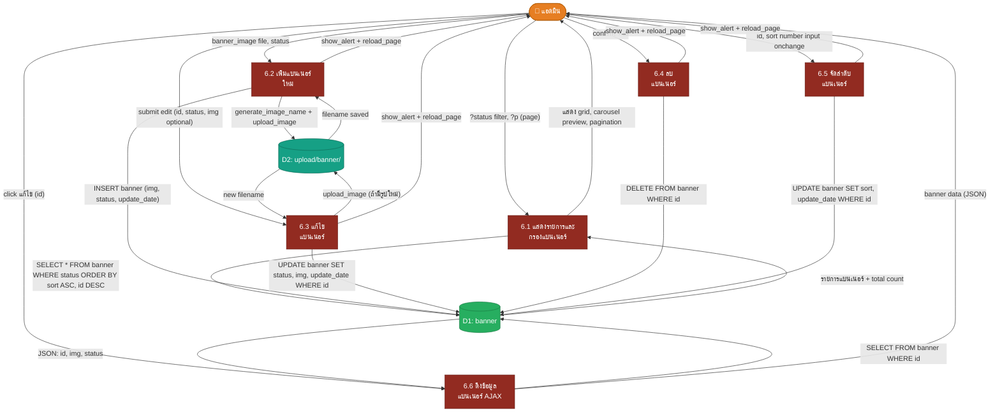

# DFD Level 2 — Process 6: ระบบจัดการแบนเนอร์

> อ้างอิงจากโค้ดจริงในระบบ: `admin/pages/banners.php`, `core/helpers/get_data.php`

---

## ภาพรวม Sub-Processes

| #       | กระบวนการ                                         | ไฟล์อ้างอิง                        |
| ------- | ------------------------------------------------- | ---------------------------------- |
| **6.1** | แสดงรายการและกรองแบนเนอร์ (List & Filter Banners) | `admin/pages/banners.php` (GET)    |
| **6.2** | เพิ่มแบนเนอร์ใหม่ (Add Banner)                    | `admin/pages/banners.php` (POST)   |
| **6.3** | แก้ไขแบนเนอร์ (Edit Banner)                       | `admin/pages/banners.php` (POST)   |
| **6.4** | ลบแบนเนอร์ (Delete Banner)                        | `admin/pages/banners.php` (POST)   |
| **6.5** | จัดลำดับแบนเนอร์ (Sort Banner)                    | `admin/pages/banners.php` (POST)   |
| **6.6** | ดึงข้อมูลแบนเนอร์ (Fetch Banner Data)             | `core/helpers/get_data.php` (AJAX) |

---

## External Entities

| สัญลักษณ์ | ชื่อ           | บทบาท                                                       |
| --------- | -------------- | ----------------------------------------------------------- |
| **E1**    | แอดมิน (Admin) | ผู้จัดการแบนเนอร์ทั้งหมด: เพิ่ม, แก้ไข, ลบ, กรอง, จัดลำดับ |

---

## Data Stores

| สัญลักษณ์ | ชื่อ DB Table    | ฟิลด์หลัก                                    |
| --------- | ---------------- | -------------------------------------------- |
| **D1**    | `banner`         | `id`, `img`, `status`, `sort`, `update_date` |
| **D2**    | `upload/banner/` | ไฟล์รูปภาพจริงบน filesystem                  |

---

## แผนภาพ DFD Level 2



---

## รายละเอียด Sub-Processes

### 6.1 แสดงรายการและกรองแบนเนอร์

> ไฟล์: `admin/pages/banners.php` (GET handler)

| Flow           | รายละเอียด                                                                           |
| -------------- | ------------------------------------------------------------------------------------ |
| **Input**      | `?status` (filter: ทุกสถานะ / 1=เปิด / 0=ปิด), `?p` (page number)                   |
| **Pagination** | `per_page = 9`, `offset = (page - 1) * 9`                                           |
| **Query**      | `SELECT * FROM banner [WHERE status='...'] ORDER BY sort ASC, id DESC`               |
| **Slice**      | `array_slice(fetch($result), $offset, $per_page)` — Pagination ฝั่ง PHP             |
| **Carousel**   | แสดง Bootstrap Carousel Preview จากแบนเนอร์ทั้งหมดที่ผ่าน filter                    |
| **Grid**       | แสดง card grid 3 คอลัมน์: รูปภาพ, สถานะ badge, sort input, วันอัปเดต, ปุ่มแก้ไข/ลบ |
| **Output**     | หน้ารายการแบนเนอร์พร้อม preview carousel, pagination, และปุ่ม action                 |

---

### 6.2 เพิ่มแบนเนอร์ใหม่

> ไฟล์: `admin/pages/banners.php` — `case 'add'`

| Flow              | รายละเอียด                                                               |
| ----------------- | ------------------------------------------------------------------------ |
| **Input**         | `banner_image` (file upload, required), `status` (1=เปิด / 0=ปิด)       |
| **Validation**    | `is_image($file)` — รองรับ JPG, JPEG, PNG, GIF, WEBP เท่านั้น            |
| **Generate Name** | `generate_image_name($file)` — สร้างชื่อไฟล์ unique                      |
| **Upload**        | `upload_image($file, $filename, 'banner/')` → บันทึกที่ `upload/banner/` |
| **INSERT banner** | `img = $filename`, `status`, `update_date = NOW()`                       |
| **Output**        | `show_alert('เพิ่มป้ายโฆษณาสำเร็จ')` + `reload_page()`                 |

> [!NOTE]
> ฟิลด์ `sort` ไม่ถูกตั้งค่าตอนเพิ่มใหม่ — แบนเนอร์ใหม่จะเรียงด้วย `id DESC` จนกว่าจะกำหนด sort ด้วยกระบวนการ 6.5

---

### 6.3 แก้ไขแบนเนอร์

> ไฟล์: `admin/pages/banners.php` — `case 'edit'` + AJAX fetch จาก `core/helpers/get_data.php`

| Flow                  | รายละเอียด                                                                        |
| --------------------- | --------------------------------------------------------------------------------- |
| **Modal Trigger**     | คลิกปุ่ม "แก้ไข" → JS fetch `GET /core/helpers/get_data.php?type=banner&id={id}` |
| **AJAX Response**     | `JSON: { id, img, status }` → populate modal form (รูปปัจจุบัน + สถานะ)          |
| **Input (submit)**    | `id` (hidden), `status`, `banner_image` (file, optional)                          |
| **Image Condition**   | อัปโหลดรูปใหม่เฉพาะเมื่อ `$_FILES['banner_image']['size'] > 0`                   |
| **Validation**        | `is_image()` (เฉพาะกรณีมีไฟล์ใหม่)                                               |
| **Upload (optional)** | `generate_image_name()` + `upload_image()` → `upload/banner/`                    |
| **UPDATE banner**     | `status`, `[img]`, `update_date = NOW()` WHERE `id`                               |
| **Output**            | `show_alert('แก้ไขป้ายโฆษณาสำเร็จ')` + `reload_page()`                          |

> [!IMPORTANT]
> รูปภาพเดิม **ไม่ถูกลบออกจาก filesystem** เมื่ออัปโหลดรูปใหม่ — ระบบอัปเดตเฉพาะชื่อไฟล์ใน DB

---

### 6.4 ลบแบนเนอร์

> ไฟล์: `admin/pages/banners.php` — `case 'delete'`

| Flow        | รายละเอียด                                                     |
| ----------- | -------------------------------------------------------------- |
| **Trigger** | คลิกปุ่ม "ลบ" → `confirm()` dialog → submit hidden form       |
| **Input**   | `id` (hidden field ใน `#deleteForm`)                           |
| **Guard**   | JavaScript `confirm()` ก่อน submit — ป้องกันลบโดยไม่ตั้งใจ    |
| **DELETE**  | `delete_by_id('banner', $id)` → `DELETE FROM banner WHERE id` |
| **Output**  | `show_alert('ลบป้ายโฆษณาสำเร็จ')` + `reload_page()`          |

> [!WARNING]
> การลบแบนเนอร์ **ไม่ได้ลบไฟล์รูปภาพออกจาก `upload/banner/`** — ไฟล์รูปยังคงอยู่บน filesystem

---

### 6.5 จัดลำดับแบนเนอร์

> ไฟล์: `admin/pages/banners.php` — `case 'sort'`

| Flow             | รายละเอียด                                                                        |
| ---------------- | --------------------------------------------------------------------------------- |
| **Trigger**      | เปลี่ยนค่า `.sort-input` (number input บน card แต่ละใบ) → debounce 500ms → submit |
| **Input**        | `id`, `sort` (integer ≥ 0)                                                        |
| **Debounce**     | JS `setTimeout` 500ms ป้องกัน request ซ้ำระหว่างพิมพ์                             |
| **UPDATE**       | `UPDATE banner SET sort = $sort, update_date = NOW() WHERE id = $id`              |
| **Query Order**  | `ORDER BY sort ASC, id DESC` — sort น้อยแสดงก่อน, sort เท่ากันเรียง id ใหม่ก่อน  |
| **Output**       | `show_alert('จัดลำดับป้ายโฆษณาสำเร็จ')` + `reload_page()`                       |

---

### 6.6 ดึงข้อมูลแบนเนอร์ (AJAX Endpoint)

> ไฟล์: `core/helpers/get_data.php` — `case 'banner'`

| Flow       | รายละเอียด                                                                               |
| ---------- | ---------------------------------------------------------------------------------------- |
| **Method** | GET — `?type=banner&id={banner_id}`                                                      |
| **Query**  | `get_by_id('banner', $id)` → `SELECT * FROM banner WHERE id`                             |
| **Output** | `JSON: { id, img, status, sort, update_date }` หรือ `{ error: 'Banner not found' }`     |
| **Used by** | กระบวนการ 6.3 — populate ข้อมูลใน Edit Modal                                            |

---

## Data Dictionary

### ตาราง `banner` (D1)

| ฟิลด์         | ประเภทข้อมูล | คำอธิบาย                           |
| ------------- | ------------ | ---------------------------------- |
| `id`          | INT (PK)     | รหัสแบนเนอร์ (auto increment)      |
| `img`         | VARCHAR      | ชื่อไฟล์รูปภาพใน `upload/banner/`  |
| `status`      | TINYINT      | 1 = เปิดใช้งาน, 0 = ปิดใช้งาน     |
| `sort`        | INT          | ลำดับการแสดงผล (น้อย = แสดงก่อน)  |
| `update_date` | DATETIME     | วันเวลาที่อัปเดตล่าสุด             |

### Filesystem Store `upload/banner/` (D2)

| รายการ      | คำอธิบาย                                                         |
| ----------- | ---------------------------------------------------------------- |
| **Path**    | `{project_root}/upload/banner/`                                  |
| **Format**  | JPG, JPEG, PNG, GIF, WEBP                                        |
| **Naming**  | สร้างโดย `generate_image_name()` — ชื่อ unique ป้องกัน overwrite |
| **Access**  | `../upload/banner/{filename}` (relative จาก admin)               |

---

## สรุป Data Flows หลัก

```
แอดมิน ──[?status, ?p]──► 6.1 ──SELECT banner──► D1 (banner)
                           6.1 ──แสดง carousel + grid──► แอดมิน

แอดมิน ──[img_file, status]──► 6.2 ──validate + upload──► D2 (filesystem)
                                6.2 ──INSERT banner──► D1 (banner)

แอดมิน ──[click แก้ไข id]──► 6.6 ──SELECT banner WHERE id──► D1
                               D1 ──JSON──► 6.6 ──► แอดมิน (modal)
แอดมิน ──[submit edit]──► 6.3 ──upload optional──► D2 (filesystem)
                           6.3 ──UPDATE banner──► D1 (banner)

แอดมิน ──[confirm ลบ]──► 6.4 ──DELETE banner──► D1 (banner)

แอดมิน ──[เปลี่ยน sort]──► 6.5 ──UPDATE banner.sort──► D1 (banner)
```

---

## Logic พิเศษในระบบ

| Feature               | รายละเอียด                                                                                |
| --------------------- | ----------------------------------------------------------------------------------------- |
| **Sort Order**        | `ORDER BY sort ASC, id DESC` — banner sort=0 ทุกใบเรียงตาม id ใหม่ก่อน                  |
| **PHP-side Pagination** | `array_slice()` หลัง fetch ทั้งหมด — เหมาะกับข้อมูลน้อย (≤ หลักร้อย)               |
| **Debounce Sort**     | JS `setTimeout` 500ms — ป้องกัน request flood เมื่อพิมพ์ตัวเลข sort                     |
| **No File Cleanup**   | ทั้งการแก้ไขและลบแบนเนอร์ **ไม่มีการลบไฟล์รูปจาก filesystem** อัตโนมัติ                |
| **Status Filter**     | กรองด้วย `?status=1` หรือ `?status=0` — ค่าว่างหมายถึง "ทุกสถานะ"                      |
| **AJAX Edit Prefill** | ข้อมูล Edit Modal โหลดแบบ AJAX จาก `get_data.php` ไม่ใช่ PHP inline render               |
| **Image Validation**  | `is_image()` — รองรับ JPG, JPEG, PNG, GIF, WEBP; reject ไฟล์ประเภทอื่น                   |
